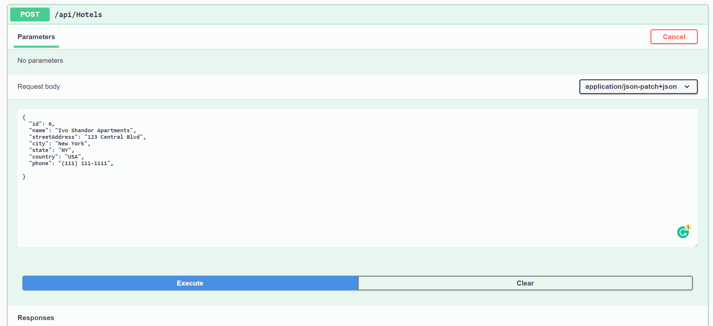

# Async Inn

## We welcome you at any time!

---

### Check us out!

[https://asyncinn20210203102731.azurewebsites.net/](https://asyncinn20210203102731.azurewebsites.net/)

---
## Web Application
***[Explain your app, should be at least a paragraph. What does it do? Why should I use? Sell your product!]***

This web application API demonstrated the use of SQL Database management through .NET Core.  It utilizes Entity Framework Core, ASP.NET 3.1 and MVC Framework.

An interface is provided utilizing Swagger to utilize all the CRUD functionality.  User can manage hotels, rooms, and ammenities that are included therein.

User Authentication is also provided to a secure way to edit and perform required maintence and retrieval of information.

---

## Tools Used
Microsoft Visual Studio Community 2019 (Version 16.8.3)

- Azure Web Services 
- C#
- ASP.Net Core 3.1
- Entity Framework
- MVC
- xUnit 
- ASP.NET Core Swagger

---

## Recent Updates

#### V 1.0

*Initial Deployment* - 2 Jan 2021

#### V 2.0

*Added User Authentication* - 3 Jan 2021

#### V 3.0

*Added User Roles and Policies*

#### V 4.0

*Updated all routes with appropriate policy access*

---

## Getting Started

Clone this repository to your local machine.

```
$ git clone https://github.com/YourRepo/YourProject.git
```
Once downloaded.  Open in Visual Studio. 

Open the **Package Manager Console** 

Ensure all the packages are installed.


You will be requird to perform an initial migration.

``dotnet build``

Perform the initial migration

``Add-Migration Initial``

``update-database``

Individual setting can be customized in the `appsettings.json` file.

The database has now been created.  You can run the application using **IIS Express**

Unit Testing has been included in the **AsyncImmTests** project.
``..\AsyncInnTests``

---
## Roles and Policies

### Roles with Policy Assignments

| Role | Policy |
| --- | --- |
| District Manager| A, B, C|
| Property Manager| B, C|
|Agent|C|
|Anonymous| Able to view all *Get* Requests|

### Policy Legend

|Policy Code|Description|
| --- | --- |
|A| Full CRUD access to all entities.  Can Add/Modify/Delete Users in any roles 
|B| Can add/update/Read new HotelRooms to hotels.  Can Add new agents.
||Add Amenities to Rooms|
|C|Update/Read HotelRoom.  
||Add/Delete Amenities to Rooms|

---
## Usage

CRUD Operations are available for demonstration from the **Swagger** powered UI page.


### Creating/Adding A New Hotel


---

## Data Flow (Frontend, Backend, REST API)


---
## Data Model

### Overall Project Schema
Stand Alone Tables are *Room* (Types), *Hotel*, and *Amenities*.  *Room*(Types) and *Hotel* are joined by a Joined Table with payload *Room*(Types).  *Room* and *Amenities* are joined by *AmenitiesRoom*


---
## Model Properties and Requirements

### Amenity (Table)

| Parameter | Type | Required |
| --- | --- | --- |
| ID  | int | YES |
| Name | string | NO |

### Hotel (Table)

| Parameter | Type | Required |
| --- | --- | --- |
| ID | int | YES |
| Name | string | YES |
| StreetAddress | string | YES |
| City | string | YES |
| State | string | YES |
| Phone | string | YES |

---

### HotelRoom (Join Table With Payload)

| Parameter | Type | Required |
| --- | --- | --- |
| HotelID | int | YES |
| RoomNumber | string | YES |
| Rate | string | NO |
| PetFriendly | string | NO |
| RoomID | string | NO |

### Register User (Table)

| Parameter | Type | Required |
| --- | --- | --- |
| UserName | string | YES |
| Password | string | YES |
| Email | string | YES |
| PhoneNumber | string | NO |

### Room (Table)

| Parameter | Type | Required |
| --- | --- | --- |
| ID | int | NO |
| Name | string | YES |
| Rate | string | NO |
| Layout | string | NO |

## Change Log

**1.0** Inital Commit - CRUD Operation Not Complete. - 1 FEB 2021

**1.1** Fixed CRUD Operations - 2 FEB 2021

**1.1.1** Updated README - 2 FEB 2021

**2.0**  Added User Registration/Authentication

---

## Authors
JP Jones

---

## License: MIT
